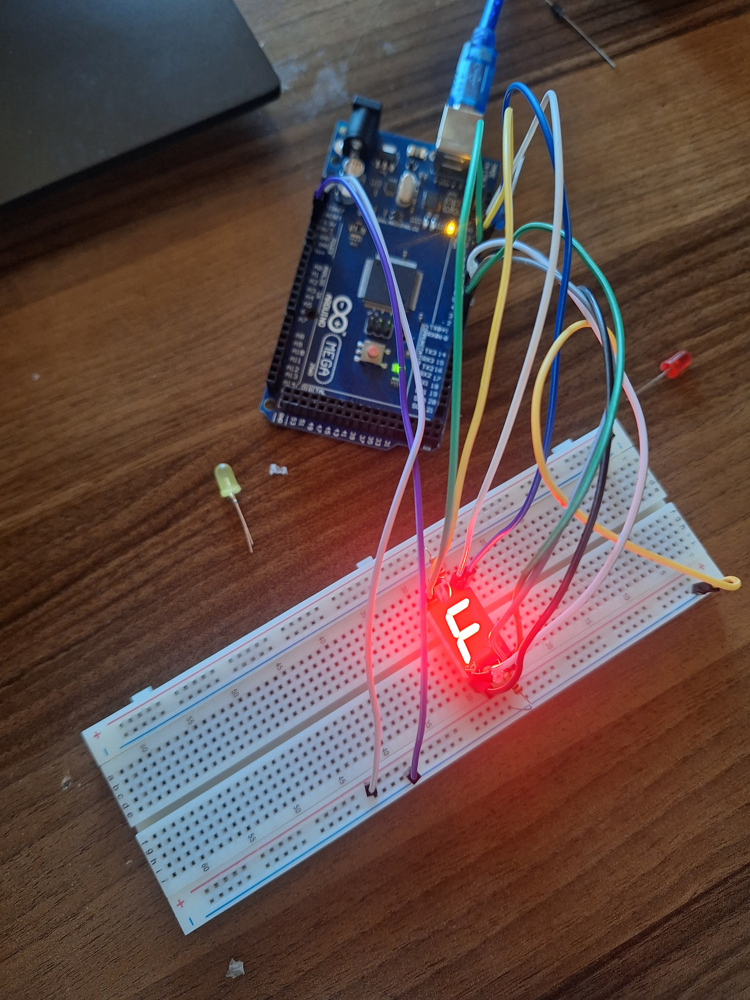

# 🔢 7 Segment Display ile Rakam Gösterimi

## 🔍 Amaç
Bu projede **7 segment display** kullanılarak Arduino üzerinden belirli rakamların gösterilmesi sağlanmıştır.
Öncelikle ortak anot mu katot mu olduğu denenerek tespit edildi.
Ben bu aşamada 1, 7 ve "F" karakterleri üzerinde çeşitli denemeler yaparak ledi yaktım.

## 🧰 Kullanılan Malzemeler
- 1 x Arduino 
- 1 x 7 Segment Display
- 7 x 220 ohm direnç
- Jumper kablolar
- Breadboard

## 📷 Devre Görseli

## ⚙️ Devre Bağlantısı
7 segment display’in a-g segment bacakları Arduino’nun dijital pinlerine şu şekilde bağlanmıştır:

| Segment | Arduino Pin |
|---------|-------------|
| A       | 11          |
| B       | 10          |
| C       | 3           |
| D       | 4           |
| E       | 5           |
| F       | 9           |
| G       | 8           |

Her segmente birer 220 ohm direnç eklenmesi tavsiye edilir. Ortak katot (GND) bacağı doğrudan GND'ye bağlanmalıdır.

