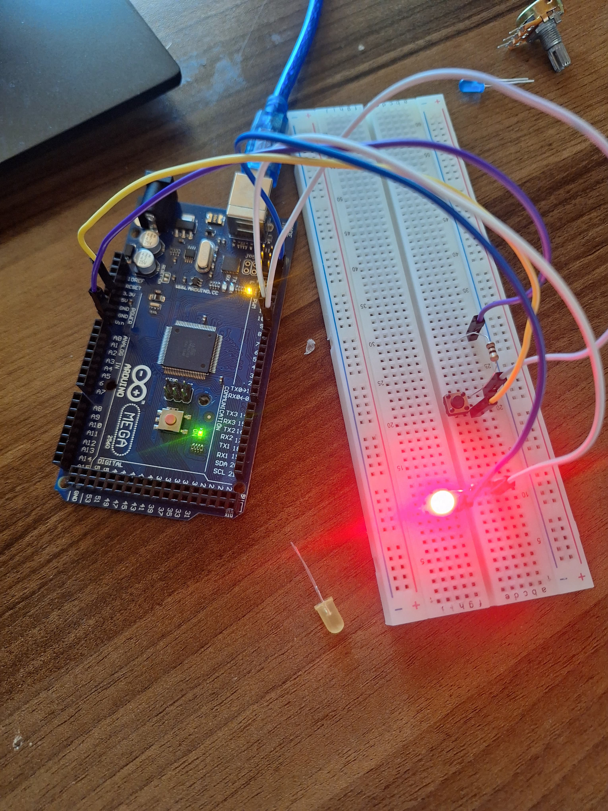

# 🔘 Buton ile LED Kontrolü

## 🔍 Amaç
Bu devrede bir butona basıldığında LED’in yanması, bırakıldığında ise sönmesi sağlanmıştır. Dijital giriş ve çıkış kavramları öğrenilmiştir.

## 🧰 Kullanılan Malzemeler
- 1 x Arduino Uno
- 1 x LED
- 1 x 220 ohm direnç
- 1 x Push Button (buton)
- Jumper kablolar
- Breadboard
## 📷 Devre Görseli

## ⚙️ Devre Bağlantısı
- Butonun bir ucu 5V’a, diğer ucu 8 numaralı dijital pine bağlandı.
- LED’in uzun bacağı (anot) 9 numaralı dijital pine bağlandı.
- LED’in kısa bacağına 220 ohm direnç bağlanarak GND’ye çekildi.
