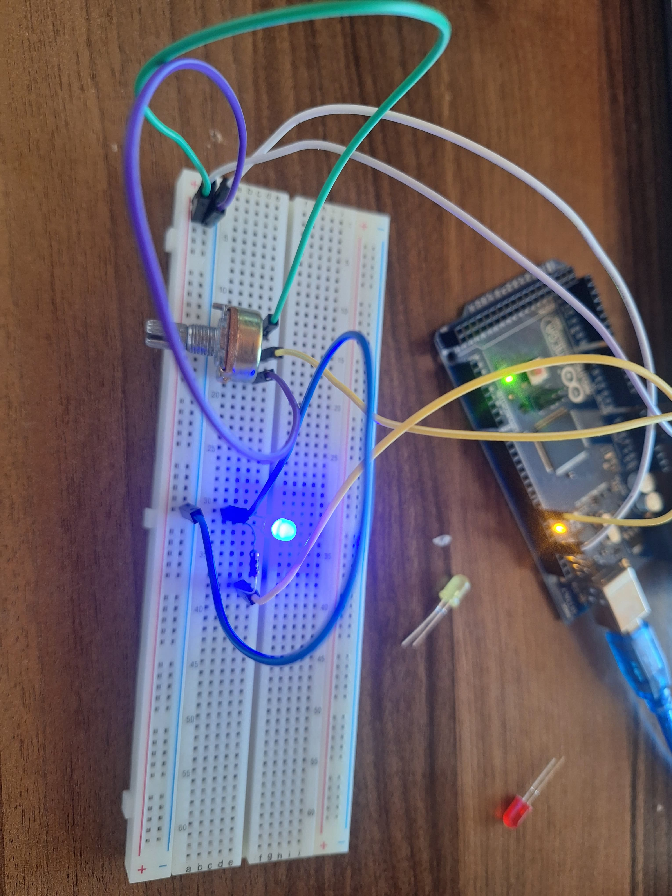

# 🎛️ Potansiyometre ile LED Parlaklık Kontrolü

## 🔍 Amaç
Potansiyomtre kullanarak bağlanan ledin parlaklığı gözlemlendi.
## 🧰 Kullanılan Malzemeler
- 1 x Arduino 
- 1 x LED
- 1 x 220 ohm direnç
- 1 x Potansiyometre
- Jumper kablolar
- Breadboard
 ## 🖼️ Devre Görseli

## ⚙️ Devre Bağlantısı
- LED’in uzun bacağı 9 numaralı dijital pine bağlandı.
- LED’in kısa bacağına 220 ohm direnç bağlanarak GND’ye çekildi.
- Potansiyometre:
  - Ortadaki bacak: A0 pinine
  - Diğer uçlar: 5V ve GND

