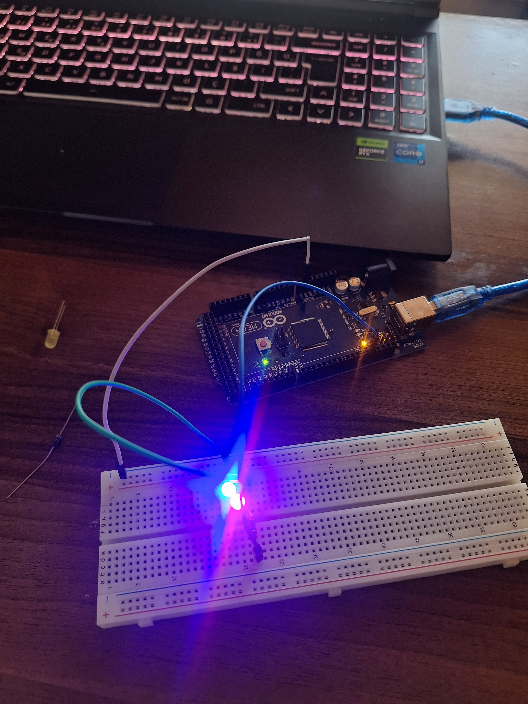

# 💡 İki LED'in Sıralı Yanıp Sönmesi

## 🔍 Amaç
Bu devrede iki LED sırayla yakılıp söndürülülmüştür. Ledler arasındaki zaman farkı değiştirilerek çeşitli gözlemler yapıldı.

## 🧰 Kullanılan Malzemeler
- 1 x Arduino 
- 2 x LED
- 2 x 220 ohm direnç
- Jumper kablolar
- Breadboard
## 📷 Devre Görseli

## ⚙️ Devre Bağlantısı
- 1. LED’in uzun bacağı (anot) 12 numaralı dijital pine bağlandı, kısa bacağı 220 ohm direnç ile GND’ye bağlandı.
- 2. LED’in uzun bacağı 13 numaralı dijital pine bağlandı, kısa bacağı 220 ohm direnç ile GND’ye bağlandı.
